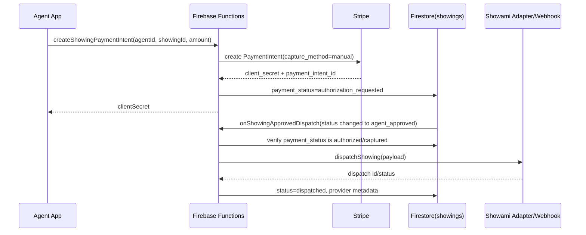

# Sprint 3.1: Showings Architecture, TC Handoff & Agent Tools

## 🎯 Objective
Kick off Phase 3 by implementing the open-flow architecture for property showings (Showami-ready), reintroducing Stripe to handle the $50 physical showing charge (bypassing RevenueCat), establishing the accepted offer handoff to the Transaction Coordinator (TC), and building the Agent "Holiday Mode" bypass.

---

## 📋 Core Tasks & Scope

### 1) Agent "Holiday Mode" (Out of Office Bypass)
Allow agents to step away without blocking their buyers' offers.
- [x] Add `outOfOffice` boolean to the core `UserModel` in Firestore.
- [x] Update Agent Settings/Profile UI to include a toggle for Holiday Mode.
- [x] Modify `OfferRepository`: When a buyer submits an offer, check the agent's OOO status. If `true`, auto-forward the offer to seller/TC queue metadata and notify the agent that auto-forward happened.

### 2) Showami / Provider-Agnostic Showings Architecture
Build the structural foundation for requesting and approving property tours.
- [x] Define the `showings` Firestore collection schema (Status: `pending`, `agent_approved`, `dispatched`, `completed`, `canceled`).
- [x] Add an `autoApproveShowings` toggle inside the Buyer-Agent relationship tracking.
- [x] Create the Buyer "Request Showing" bottom sheet / UI flow. *(Confirmed via Phase 2 `ScheduleTourSheet` that triggers `CreateShowing` BLoC)*
- [x] Build the Agent "Approve Showing" confirmation UI (applicable if `autoApproveShowings` is false).

### 3) Stripe Re-Integration Foundation
Replace the digital-only subscriptions with a physical goods/services payment flow.
- [x] Ensure `flutter_stripe` is cleanly integrated for capturing Agent payment methods.
- [x] Diagram the cloud-function logic: When a showing is approved, a $50 PaymentIntent is authorized against the Agent's Stripe Customer ID *before* firing the Showami dispatch webhook.

### 4) Transaction Coordinator (TC) Handoff
Prepare the data pipeline so external/internal TC platforms can take over successfully negotiated offers.
- [x] Define a `transactions` Firestore collection.
- [x] Modify `OfferBloc` and `OfferRepository.acceptOffer()`: When an offer is marked as Accepted, branch a copy of the finalized offer data into the `transactions` collection.
- [x] Set up transaction metadata (Status: `under_contract`, tracking the final price, buyer, seller, and agent).

---

## 🏗️ Architecture Targets

### The Adapter Pattern for Showings
The mobile client will **never** talk directly to Showami. 
- Mobile App writes `showing_request` to Firestore.
- Firebase Cloud Functions listen to `showing_request`.
- Cloud Function holds an interface (e.g., `IShowingProvider`). 
- We will document/build a `ShowamiAdapter` that fulfills that interface. If the business shifts to another provider, only the Cloud Function changes.

### App Store Compliance (Stripe)
- Because the $50 charge is a real-world physical service (hiring a showing assistant to open a physical door), we are legally allowed, and required, to use an external processor like Stripe rather than Apple/Google's In-App Purchases (which take a 30% cut for digital goods).

### Cloud Function Sequence (Implemented)

## Next Steps
1. Add Stripe webhook handlers to move `payment_status` from `authorization_requested` -> `authorized`/`captured`.
2. Add retry/backoff queue for Showami dispatch failures.
3. Add automated tests for OOO bypass and transaction-queue creation.
4. Add monitoring dashboards for showings dispatch and TC handoff latency.